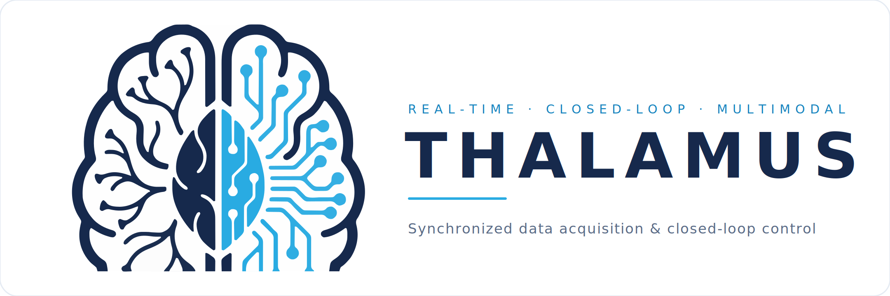

<div align="center">

<a href="https://cajigaslab.github.io/Thalamus/">
  
</a>

<p><em>Real-time, synchronized, closed-loop multimodal data acquisition — built for the operating room and the research lab.</em></p>

<p>
  <a href="https://github.com/cajigaslab/Thalamus/releases"></a>
  
  
  <a href="LICENSE"></a>
  <a href="https://cajigaslab.github.io/Thalamus/"></a>
  <a href="https://www.nature.com/articles/s44172-026-00646-z"></a>
</p>

<p>
  <a href="https://cajigaslab.github.io/Thalamus/quickstart.html"><b>Quick&nbsp;Start</b></a> ·
  <a href="https://cajigaslab.github.io/Thalamus/concepts.html">How&nbsp;it&nbsp;works</a> ·
  <a href="https://cajigaslab.github.io/Thalamus/nodes/index.html">Node&nbsp;Reference</a> ·
  <a href="https://cajigaslab.github.io/Thalamus/examples/index.html">Examples</a> ·
  <a href="https://www.nature.com/articles/s44172-026-00646-z">Paper</a>
</p>

</div>

---

Thalamus is an open-source platform for real-time, synchronized, closed-loop
multimodal data capture, specifically tailored to meet the stringent demands of
neurosurgical environments — while serving equally well in the research lab.

## How it works

Thalamus assembles experiments from a **pipeline of nodes**. Each node is a small,
configurable unit that plays one of four roles:

| Role | Does | Examples |
| --- | --- | --- |
| 🟢 **Generators** | produce data | `WAVE`, `NIDAQ`, `INTAN`, `SPIKEGLX`, `GENICAM` |
| 🔵 **Consumers** | record / output data | `STORAGE2`, `LOG`, `NIDAQ_OUT`, `OPHANIM` |
| 🟣 **Transformers** | consume → produce data | `OCULOMATIC`, `ALGEBRA`, `LUA`, `NORMALIZE`, `ARUCO` |
| 🟠 **Controllers** | coordinate the pipeline | `RUNNER2`, `TASK_CONTROLLER` |

You build an experiment by adding nodes, configuring them, and subscribing consumers
to the producers they care about. Recorded data is written to a compact `.tha`
capture file and converted to analysis-friendly formats (HDF5, CSV, Parquet, …) with
the bundled tooling. See the
[Node Reference](https://cajigaslab.github.io/Thalamus/nodes/index.html) for the full
catalog of node types and the
[Concepts guide](https://cajigaslab.github.io/Thalamus/concepts.html) for the data
model and file format.

## Overview

Thalamus facilitates the advancement of clinical applications of Brain-Computer
Interface (BCI) technology by integrating behavioral and electrophysiological data
streams.

<details>
<summary><b>Design requirements Thalamus prioritizes</b></summary>

1. Requires minimal setup within an operating room, clinical and research environment and could be easily controlled and quickly modified by the experimenter​
2. Operated with high reliability with few crashes​
3. Fail-safe architecture that guarantees minimal data loss in the setting of a crash​
4. Allows for real-time computation to support visualizations of research and clinical data streams​
5. Closed-loop control based on research and/or clinical data streams​
6. Acquires synchronous data from the available research and clinical sensors including relevant behavioral, physiologic, and neural sensors that could easily be scaled over time​
7. Supports a high-bandwidth, low latency, parallel distributed architecture for modular acquisition and computation that could easily be upgraded as technology continues to advance​
8. Open-source with source code available to support research use​
9. Embodies best practice in software engineering using unit tests and validation checks​
10. Supports advances in translational applications and, hence, also operates in research domains​

</details>

## Installation

Download the wheel for your platform from the
[Releases](https://github.com/cajigaslab/Thalamus/releases) page (or the Actions tab).
The package is published as **`thalamus_neuro`**; the importable module remains
`thalamus`. Builds are provided for **Linux** (manylinux), **Windows** (10+), and
**macOS** (arm64). Thalamus requires **Python 3.10+**.

We recommend a virtual environment so the bundled `grpc` version is not disturbed:

```bash
python -m venv venv-thalamus
source venv-thalamus/bin/activate        # Linux/macOS
call venv-thalamus/scripts/activate      # Windows
```

Then install the wheel for your platform, for example:

```bash
# Linux
python -m pip install thalamus_neuro-1.0.15-py3-none-manylinux_2_39_x86_64.whl
# Windows
python -m pip install thalamus_neuro-1.0.15-py3-none-win_amd64.whl
# macOS (arm64)
python -m pip install thalamus_neuro-1.0.15-py3-none-macosx_12_0_arm64.whl
```

> **Note** — Drivers and runtimes for third-party devices (e.g. GenTL/GenICam
> cameras, National Instruments DAQs) must be installed separately. Thalamus itself
> only needs a standard computer with enough RAM for in-memory operation.

### Run

```bash
python -m thalamus.pipeline            # Data pipeline (no task controller)
python -m thalamus.task_controller     # Data pipeline and task controller
python -m thalamus.hydrate FILE        # Convert a .tha capture file to HDF5
python -m thalamus.dataframe ...        # Export a node's data to CSV/Parquet/…
python -m thalamus.record_reader2 FILE  # Inspect the contents of a .tha file
```

## Documentation

Full documentation lives at **https://cajigaslab.github.io/Thalamus/**:

- [**Quick Start**](https://cajigaslab.github.io/Thalamus/quickstart.html) — install, build a pipeline, record, and analyze your first dataset.
- [**Concepts & Architecture**](https://cajigaslab.github.io/Thalamus/concepts.html) — the node pipeline, data model, capture-file format, and tooling.
- [**Examples**](https://cajigaslab.github.io/Thalamus/examples/index.html) — runnable, copy-paste tutorials (including a hardware-free walkthrough).
- [**Node Reference**](https://cajigaslab.github.io/Thalamus/nodes/index.html) — every node type and its configuration.

Runnable example scripts also live in the [`examples/`](examples/) folder. For the
figures in our paper, see the [`SimpleUseCase`](SimpleUseCase/) folder. Release
history is in [CHANGELOG.md](CHANGELOG.md).

## Contributing

Like all open-source projects, Thalamus benefits from your involvement, suggestions,
and contributions. Use the **Issues** tab to report bugs and request features, and
see [CONTRIBUTING.md](CONTRIBUTING.md) for the repository layout, development setup,
how to add a new node type, and the pull-request and release process.

## License & citation

Thalamus is released under the GPL-3.0 license (see [LICENSE](LICENSE)). If you use
Thalamus in your work, please cite our paper:

> *Thalamus: a real-time, closed-loop platform for synchronized multimodal data
> acquisition.* Communications Engineering (Nature).
> https://www.nature.com/articles/s44172-026-00646-z
