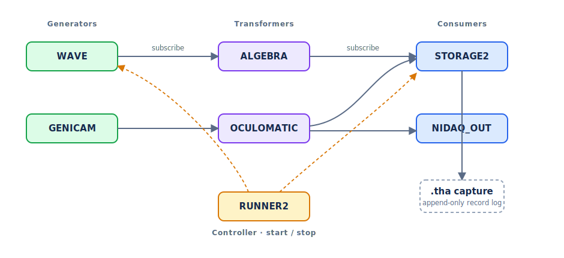

Concepts and Architecture
=========================

This page explains how Thalamus is put together: the node pipeline, the data model
that flows through it, the capture-file format, and the tooling that turns
recordings into analysis-ready data.  It complements the :doc:`quickstart` (which
walks through using the program) and the :doc:`Node Reference <nodes/index>` (which
documents each node type).

.. admonition:: Mental model

   Think of a Thalamus session as a **directed graph of nodes on one shared
   nanosecond timeline**.  Producers generate data; consumers and transformers
   *subscribe* to the producers whose data they need; and a STORAGE2 node writes
   every message from the nodes it is subscribed to into the ``.tha`` capture log.

The node pipeline
-----------------

A Thalamus session is a **pipeline of nodes**.  Each node is a small, independently
configurable unit, and every node plays one of four roles:

* **Generators** produce data -- hardware acquisition (NIDAQ, INTAN, SPIKEGLX,
  GENICAM, ...) or software sources (WAVE, WALLCLOCK, PUPIL).
* **Consumers** terminate data -- recording it (STORAGE2), logging it (LOG), or
  driving an output device (NIDAQ_OUT, OPHANIM).
* **Transformers** consume data and produce new data -- analysis and mapping
  (OCULOMATIC, ALGEBRA, LUA, NORMALIZE, ARUCO, ...).
* **Controllers** coordinate the pipeline -- starting and stopping groups of nodes
  (RUNNER, RUNNER2, TASK_CONTROLLER).

You build an experiment by adding nodes, setting each node's type and properties,
and **subscribing** consumers/transformers to the producers whose data they need.
Most nodes have a small set of inline properties; nodes with richer configuration
also provide a *node widget* that appears when the node is selected.  See the
:doc:`Node Catalog <nodes/catalog>` for the full list of types.

Because nodes are decoupled and communicate over gRPC, a pipeline can also span
machines: a :doc:`REMOTE <nodes/remote>` node proxies another instance's stream, and
a :doc:`RUNNER2 <nodes/runner2>` node can start/stop nodes on remote instances.

The data model
--------------

All data is carried in a single message type, ``StorageRecord``.  Every record has a
``node`` (the producing node's name), a ``time`` (see below), and exactly one *body*
that determines the kind of data:

.. _ulong-data:

* **analog** -- time-series samples.  An ``AnalogResponse`` holds a flat ``data``
  array, a list of ``spans`` that name each channel and mark its slice of ``data``
  (``begin``/``end``), and a ``sample_intervals`` array giving each channel's sample
  period in nanoseconds.  Integer-valued streams use ``int_data`` (32-bit signed) or
  ``ulong_data`` (64-bit unsigned, for counters/timestamps and other large integer
  values); ``thalamus.record_reader2`` and ``thalamus.dataframe`` read all three.
* **image** -- a video/camera frame, with raw bytes, ``width``, ``height``,
  pixel ``format`` (e.g. ``Gray``, ``RGB``, ``MPEG4``), and ``frame_interval``.
* **text** -- a string message (log lines, event markers).
* **xsens** -- motion-capture pose data: body segments with position and quaternion
  rotation.
* **metadata** -- key/value pairs (string, integer, or decimal).
* **compressed** -- a compressed payload wrapping one of the above (used when analog
  or video compression is enabled).

This uniform model is why the same tools work across modalities, and why a single
recording can interleave signals, video, markers, and motion on one timeline.

Time
----

Record timestamps are expressed in **nanoseconds from a steady clock**, not a Unix
epoch.  The clock is monotonic relative to an arbitrary start point, which makes it
ideal for measuring intervals and latencies but means timestamps are not wall-clock
dates.  To anchor a recording to absolute time, include a :doc:`WALLCLOCK
<nodes/wallclock>` node.  For an analog record, the ``time`` marks the moment of the
record's last sample, so the time of every sample can be reconstructed from the
sample interval.

The capture-file format
-----------------------

A recording is a ``.tha`` capture file: a flat sequence of records, each written as
an 8-byte big-endian length prefix followed by the serialized ``StorageRecord``
protobuf.  A STORAGE2 node writes one record every time a node it is subscribed to
produces data, so the file is an interleaved, append-only log.

By convention the first record carries a ``metadata`` body with the recording
number (the ``Rec`` key), and a companion ``<file>.YYYYMMDD.R.json`` snapshot of the
configuration is written alongside the capture.  See the :doc:`quickstart` for an
annotated example of the records in a file.

Reading and converting recordings
----------------------------------

Several bundled modules turn a ``.tha`` file into analysis-ready data:

* ``python -m thalamus.record_reader2 FILE`` -- iterate over and print raw records.
  In Python, ``thalamus.record_reader2.SimpleRecordReader`` yields ``StorageRecord``
  messages (use it as a context manager).
* ``python -m thalamus.dataframe -n NODE -i FILE`` -- export one node's analog (or
  text) channels to CSV, Parquet, and other tabular formats.
* ``python -m thalamus.hydrate FILE`` -- convert an entire capture into a single
  HDF5 file.  For each analog channel it writes a ``data`` dataset of samples and a
  ``received`` dataset of per-record timing, from which exact sample times can be
  reconstructed.

The :doc:`examples/index` page shows each of these end to end, and the
``examples/`` folder in the repository contains runnable scripts.

Persistence
-----------

Node configurations and window layouts can be saved and reloaded, so an experiment's
full setup is reproducible.  When a node's configuration must change in a
backward-incompatible way, a new numbered node type is introduced (for example
STORAGE → STORAGE2) so existing setups keep working.
