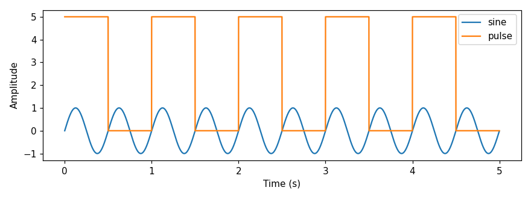
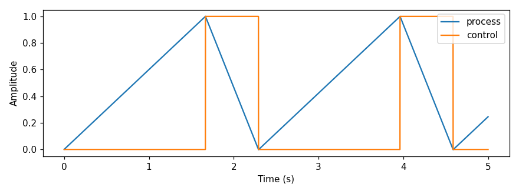

Examples
========

These examples are runnable end to end and require **no acquisition hardware**.
They mirror the scripts in the `examples/ <https://github.com/cajigaslab/Thalamus/tree/main/examples>`_
folder of the repository, so you can copy-paste from here or run the scripts
directly.

If you use Thalamus in your work, please cite our paper:
`Thalamus: a real-time, closed-loop platform for synchronized multimodal data
acquisition <https://www.nature.com/articles/s44172-026-00646-z>`_
(Communications Engineering, Nature).

.. note::

   The example scripts live in the `examples/ <https://github.com/cajigaslab/Thalamus/tree/main/examples>`_
   folder of the repository (they are not shipped in the installed wheel).  Run them
   from the repo root.  The first walkthrough below is the recommended starting point;
   later sections build on the same ``.tha`` workflow.

Synthesize and analyze a recording without hardware
----------------------------------------------------

A Thalamus recording (a ``.tha`` capture file) is simply a sequence of
length-prefixed protobuf ``StorageRecord`` messages: a leading ``metadata``
record followed by ``analog`` (or ``image``, ``text``, ...) records.  Because the
format is open, you can produce a perfectly valid recording programmatically and
then exercise the full analysis toolchain against it.

This example generates a 5-second recording with two channels -- a 2 Hz sine wave
and a 1 Hz square pulse -- and then reads, exports, hydrates, and plots it.

1. Generate a capture file
^^^^^^^^^^^^^^^^^^^^^^^^^^^

The following script writes a file that is indistinguishable from one produced by
a STORAGE2 node.  Each analog record carries 16 ms of data; channels are
concatenated in ``data`` and a ``Span`` maps each slice to a named channel.

.. code-block:: python

   import math, datetime, pathlib
   from thalamus.thalamus_pb2 import StorageRecord, AnalogResponse, Span, Metadata, Pair
   from thalamus.record_writer import write_record

   SAMPLE_RATE, POLL_MS, DURATION_S = 1000, 16, 5
   INTERVAL_NS = int(1e9 / SAMPLE_RATE)
   SAMPLES_PER_POLL = SAMPLE_RATE * POLL_MS // 1000
   total = SAMPLE_RATE * DURATION_S

   out = pathlib.Path(f"synthetic.tha.{datetime.date.today():%Y%m%d}.1")
   with out.open("wb") as stream:
       write_record(stream, StorageRecord(
           node="storage", time=0,
           metadata=Metadata(keyvalues=[Pair(key="Rec", integral=1)])))
       produced, t_ns = 0, 0
       while produced < total:
           count = min(SAMPLES_PER_POLL, total - produced)
           sine, pulse = [], []
           for i in range(count):
               t = (produced + i) / SAMPLE_RATE
               sine.append(math.sin(2 * math.pi * 2.0 * t))
               pulse.append(5.0 if int(t * 2) % 2 == 0 else 0.0)
           produced += count
           t_ns += count * INTERVAL_NS
           write_record(stream, StorageRecord(
               node="wave", time=t_ns,
               analog=AnalogResponse(
                   data=sine + pulse,
                   spans=[Span(begin=0, end=count, name="sine"),
                          Span(begin=count, end=2 * count, name="pulse")],
                   sample_intervals=[INTERVAL_NS, INTERVAL_NS], time=t_ns)))
   print("wrote", out)

The full script is available as ``examples/synthetic_recording.py``:

.. code-block::

   python examples/synthetic_recording.py -o demo.tha

2. Inspect the records
^^^^^^^^^^^^^^^^^^^^^^^

You can iterate over the records directly with ``thalamus.record_reader2``:

.. code-block::

   python -m thalamus.record_reader2 demo.tha

3. Export to CSV or Parquet
^^^^^^^^^^^^^^^^^^^^^^^^^^^^

The ``thalamus.dataframe`` module turns a node's channels into a tabular file:

.. code-block::

   python -m thalamus.dataframe -n wave -i demo.tha -f csv -o demo.csv

The output is indexed by ``counter`` (the sample timestamp in nanoseconds) with one
column per channel::

   counter,sine,pulse
   1000000,0.0,5.0
   2000000,0.012566039883352607,5.0
   ...

4. Hydrate to HDF5
^^^^^^^^^^^^^^^^^^

To produce a single self-describing HDF5 file for downstream analysis, hydrate the
capture:

.. code-block::

   python -m thalamus.hydrate demo.tha

This writes ``demo.tha.h5`` containing, for each channel, a ``data`` dataset of
samples and a ``received`` dataset of timing information (see :doc:`../quickstart`
for the layout).

5. Plot the channels
^^^^^^^^^^^^^^^^^^^^^

The ``examples/analyze_recording.py`` script reconstructs the per-channel time
series straight from the ``.tha`` file and saves a plot:

.. code-block::

   python examples/analyze_recording.py demo.tha -n wave -o analysis.png

From here you can apply any analysis you like (NumPy, SciPy, pandas, MATLAB).  For
worked analyses on real recordings -- including the figures from our paper -- see
the `SimpleUseCase <https://github.com/cajigaslab/Thalamus/tree/main/SimpleUseCase>`_
folder.

Close a loop
------------

Thalamus's defining capability is *real-time closed-loop control*: a value is
measured, a rule decides on an action, and that action feeds back and changes the
value.  In a live pipeline you wire it as ``sensor → ALGEBRA/TOGGLE (decide) →
output`` (see the pipeline diagram in :doc:`../concepts`), with the output driving
hardware that affects the sensor.

``examples/closed_loop_demo.py`` simulates exactly that loop in software so you can
run and inspect it without hardware: a process variable drifts up, a hysteresis
(bang-bang) controller switches a ``control`` output on above an upper threshold and
off below a lower one, and the control output pulls the process variable back down --
closing the loop.

.. code-block::

   python examples/closed_loop_demo.py -o loop.tha
   python examples/analyze_recording.py loop.tha -n loop -o loop.png

::

   Controller switched 4 times; the loop held the process variable in [0.00, 1.00]
   around the [0.0, 1.0] band.

The ``process`` and ``control`` channels are recorded together, so the loop is fully
reconstructable from the capture.  To *measure the latency* of a loop (the delay
between a trigger and its response), see :ref:`closed-loop-latency` below.

Record event markers (text)
---------------------------

Experiments often interleave a continuous signal with discrete *event markers*
such as ``trial_start`` or ``reward``.  Thalamus stores these as ``text`` records on
the same timeline as the analog data.  ``examples/event_markers.py`` writes a
recording with five markers on an ``events`` node plus a continuous ``reward``
analog channel on a ``daq`` node:

.. code-block::

   python examples/event_markers.py -o events.tha

Export the markers to a table with the ``text`` data type:

.. code-block::

   python -m thalamus.dataframe -n events -t text -i events.tha -f csv

::

   counter,text
   200000000,trial_start
   400000000,cue_on
   600000000,cue_off
   800000000,reward
   1000000000,trial_end

Record a synthetic video stream (images)
----------------------------------------

Camera data is stored as ``image`` records, each carrying the raw frame bytes plus
width, height, pixel format, and frame interval.  ``examples/synthetic_video.py``
writes a short ``Gray`` clip (no camera required) and extracts one frame to a PNG so
you can see how to decode image records:

.. code-block::

   python examples/synthetic_video.py -o video.tha --frame 15 --png frame.png

The key decode step is reshaping the raw bytes into a 2-D array:

.. code-block:: python

   import numpy
   from thalamus.record_reader2 import SimpleRecordReader

   with SimpleRecordReader("video.tha") as reader:
       frames = [r for r in reader if r.WhichOneof("body") == "image"]
   image = frames[15].image
   arr = numpy.frombuffer(image.data[0], dtype=numpy.uint8).reshape(image.height, image.width)

Record several nodes at once
----------------------------

A real session records many nodes into one file -- each tagged with its node name.
``examples/multinode_recording.py`` writes an ``eye`` node (channels ``x`` and ``y``)
and an ``emg`` node (channel ``ch0``):

.. code-block::

   python examples/multinode_recording.py -o session.tha

Export each node independently by name:

.. code-block::

   python -m thalamus.dataframe -n eye -i session.tha -f csv -o eye.csv
   python -m thalamus.dataframe -n emg -i session.tha -f csv -o emg.csv

Summarize any capture file
--------------------------

When you receive an unfamiliar recording, ``examples/capture_summary.py`` reports
its nodes, data types, analog channels, duration, and metadata:

.. code-block::

   python examples/capture_summary.py session.tha

::

   File: session.tha
   Records: 627  {'metadata': 1, 'analog': 626}
   Duration: 4.984 s
   Metadata: [('Rec', 1)]
   Nodes:
     emg: {'analog': 313}  channels=['ch0']
     eye: {'analog': 313}  channels=['x', 'y']
     storage: {'metadata': 1}

.. _closed-loop-latency:

Measure closed-loop latency
---------------------------

Quantifying the latency of a closed loop -- a trigger fires and a downstream system
responds some milliseconds later -- is a core Thalamus use case.
``examples/closed_loop_latency.py`` synthesizes a recording with a ``trigger`` and a
``response`` channel offset by a known delay, then recovers that delay by detecting
and pairing rising edges (the same analysis behind the closed-loop performance
figures in the paper):

.. code-block::

   python examples/closed_loop_latency.py

::

   Synthesized .../loop.tha (response lags trigger by 5 ms)
   trigger edges: 5, response edges: 5
   latency (ms): mean=5.000 std=0.000 min=5.000 max=5.000

Pass a path to analyze your own recording instead:

.. code-block::

   python examples/closed_loop_latency.py recording.tha -n daq --trigger trigger --response response

Record a uint64 (``ulong``) counter channel
--------------------------------------------

Analog streams can carry 64-bit unsigned integers (``ulong_data`` /
``is_ulong_data``) for counters, hardware timestamps, or event tallies.
``examples/ulong_counter.py`` writes a ``.tha`` whose ``counter`` node emits a uint64
sample counter, then it can be read back and exported like any other channel:

.. code-block::

   python examples/ulong_counter.py -o counter.tha
   python -m thalamus.dataframe -n counter -i counter.tha -f csv -o counter.csv

::

   counter,samples
   1000000,0
   2000000,1
   ...

Both ``thalamus.record_reader2`` and ``thalamus.dataframe`` read the ulong path
(``record.analog.is_ulong_data`` is ``True`` and the values live in
``record.analog.ulong_data``).

Write a behavioral task
-----------------------

``examples/hello_world_task.py`` is the smallest useful :doc:`Task Controller
<../task_controller>` task: it draws a square, waits for a touch (or a 5 second
timeout), logs the trial, and returns success/failure.  It is loaded by the Task
Controller rather than run standalone:

.. code-block::

   python -m thalamus.task_controller --ext examples/hello_world_task.py

It demonstrates the task API: ``create_widget`` for the control UI, an async
``run(context)`` returning a ``TaskResult``, drawing via ``context.widget.renderer``,
input via ``context.widget.touch_listener``, timing with ``context.any`` /
``context.until`` / ``context.sleep``, and ``context.log`` for trial events.  See the
:doc:`Task Controller <../task_controller>` guide for the full API.
