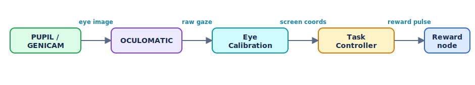

Eye Calibration
===============

The eye-calibration tool maps the **raw eye-camera signal** produced by the
:doc:`OCULOMATIC <nodes/oculomatic>` node into **gaze / screen coordinates**, so that
gaze can be used for gaze-contingent behavioral tasks and analysis.  It is an
interactive application: an operator collects a few known fixations, fits a
calibration model, and refines it live.

Running it
----------

Start a Thalamus pipeline that includes an OCULOMATIC node (producing ``X`` / ``Y``
gaze channels), then launch the calibrator, which connects to the pipeline over gRPC
(default ``localhost:50050``):

.. code-block::

   python -m thalamus.eye_calibration

Two windows open: a **subject view** (what the subject sees -- fixation point and
saccade targets) and an **operator view** (the interactive calibration interface).

Calibration models
-------------------

The active model is set by the ``Selected Model`` key under ``eye_scaling`` in the
configuration; the operator window shows which model is in use.

* **Projective** -- an 8-parameter projective (homography) mapping from raw eye
  coordinates to eye angles, followed by an angle-to-pixel conversion that uses the
  screen **Distance (m)** and **DPI**.  Fitting solves a least-squares problem over
  the collected fixation/target pairs.  *Use this* when a single global mapping fits
  the data well -- it is the simplest, most common choice.
* **Angular Scaling** -- a polar model: the raw signal's angle selects an
  interpolated **scale** and **rotation** from a set of *pins*, allowing the gain to
  vary by direction (independent X/Y behavior).  Interpolation wraps around the
  circle, and a **Scale Default** is used before any pins are set.  *Use this* when
  the eye signal is non-uniform across directions and a single projective fit leaves
  systematic error.

You can tell the calibration is good when, after fitting, the live gaze trace lands
on each saccade target as the subject fixates it.

The fitted parameters (the projective ``Parameters`` / ``Distance (m)`` / ``DPI``, or
the Angular-Scaling ``Pins`` / ``Scale Default``) live in the pipeline config, so the
calibration is saved with the experiment and reused downstream.

Workflow
--------

1. **Show targets.** Add saccade targets in the operator view and cycle through them
   so the subject fixates each in turn.
2. **Collect samples.** With the subject fixating a target, record the current gaze
   as a training sample for that target.
3. **Fit.** Press **Fit** to solve the selected model from the collected samples.
4. **Refine.** For Angular Scaling you can **nudge** pins by dragging to locally
   adjust scale/rotation; **undo/redo** is available for every change.
5. **Reset / Clear.** **Reset** restores the model to defaults; **Clear** wipes the
   accumulated gaze trace without discarding the calibration.

Operator controls
-----------------

* **Model** -- a read-only display of the active model (set via the
  ``Selected Model`` configuration).
* **Fit** / **Reset** -- fit the model to the samples / restore defaults.
* **Clear** -- clear the displayed gaze trace.
* **Hold** -- keep accumulating the gaze trace instead of trimming it to the most
  recent points.
* **Fixation Radius** / **Saccade Radius** -- on-screen sizes of the fixation point
  and the saccade targets.
* **Reward (ms)** and **Reward Node** -- duration of the reward pulse and the name of
  the node it is injected into.  A keypress in the operator view delivers a reward,
  which is injected as an analog signal on the reward node -- useful for shaping
  behavior during calibration.

Keyboard shortcuts in the operator view cover undo/redo, delivering a reward, and
cycling the active saccade target.

Walkthrough: a calibration session (no eye tracker required)
------------------------------------------------------------

You can exercise the whole gaze pipeline in software using the synthetic-eye
:doc:`PUPIL <nodes/pupil>` node, which renders a moving pupil for OCULOMATIC to
detect -- no camera or subject needed.

#. **Build the pipeline.** In ``python -m thalamus.pipeline`` add a :doc:`PUPIL
   <nodes/pupil>` node (turn on *Random Saccade* so the pupil moves), and an
   :doc:`OCULOMATIC <nodes/oculomatic>` node with PUPIL as its source.  Start both;
   OCULOMATIC should now publish ``X`` / ``Y`` gaze channels.
#. **Launch the calibrator.** Run ``python -m thalamus.eye_calibration``.  The
   operator and subject windows open and the operator view fills with the live gaze
   trace from OCULOMATIC.
#. **Place targets and collect.** Add a few saccade targets, and for each one record
   a training sample while the (synthetic) gaze sits on it.
#. **Fit.** Press **Fit** to solve the selected model; the mapped gaze should now
   land on the targets.  For Angular Scaling, drag pins to refine, using undo/redo
   freely.
#. **Use it.** The fitted ``eye_scaling`` parameters are saved with the
   configuration, so the :doc:`Task Controller <task_controller>` can drive
   gaze-contingent tasks from calibrated, screen-space gaze.

Swapping PUPIL for a real eye camera + OCULOMATIC later changes nothing about this
workflow.

Relationship to the rest of Thalamus
------------------------------------

* Input comes from the :doc:`OCULOMATIC <nodes/oculomatic>` node's gaze channels.
* The **reward** is delivered by injecting an analog signal into a node you nominate
  (e.g. a :doc:`NIDAQ_OUT <nodes/nidaq_out>` channel driving a reward device).
* The resulting calibration is consumed by the :doc:`Task Controller
  <task_controller>` so behavioral tasks can use calibrated gaze in screen
  coordinates.
