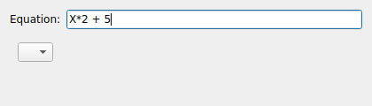

ALGEBRA
=======
|ui|

The ALGEBRA node is a transformer that evaluates a user-supplied algebraic
expression on each incoming sample.  It is a quick way to scale, offset, or
otherwise process a signal without writing code.

Usage
-----

Set the node's **Source** to the node whose data you want to transform, then enter
an expression in the **Equation** field.  The variable ``X`` refers to the incoming
sample value; for example, ``X*2 + 5`` doubles the signal and adds an offset of 5.

Properties
----------

* **Source**: The node supplying the input samples.
* **Equation**: The expression evaluated per sample.  Use ``X`` for the input value.
* **Parser Error**: A read-only indicator.  When the equation cannot be parsed the
  equation text turns red so you can correct it.

For more complex, stateful processing (where a value depends on previous samples),
use the ``LUA`` node instead.
