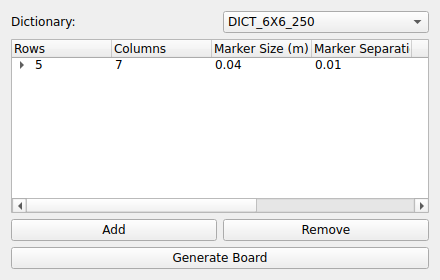

ARUCO
=====
|ui|

The ARUCO node detects ArUco / AprilTag fiducial markers in one or more image
streams and outputs the pose (position and rotation) of each configured marker
board.  It is a transformer: it consumes images from camera node(s) (e.g.
GENICAM) and produces board poses, an annotated debug image, and per-board
quality-metric channels.

Usage
-----

Add one or more camera node names to **Sources**, then configure the marker
dictionary and one or more boards.  Every listed camera is searched for the
same set of boards; if a board is detected on more than one camera, ARUCO
fuses the observations into a single reported pose for that board.

Properties
----------

* **Dictionary**: The ArUco marker dictionary the markers were generated from
  (for example a 6x6 dictionary).  This must match the printed markers.
* **Sources**: The camera nodes to search for markers on (multi-camera fusion).
  Use the Add/Remove Camera controls to build the list.
* **Boards**: A list of marker boards to detect.  Each board has:

  * **Name**: A label used to identify the board in log/metric output.
  * **Type**: ``grid`` (the default) or ``layout``.

    * ``grid`` boards describe a regular rows x columns grid: rows, columns,
      marker size and separation, and the marker ids it contains.
    * ``layout`` boards place markers independently via a **Markers** list,
      each entry giving an id and its ``x``/``y``/``z`` position and
      ``rx``/``ry``/``rz`` rotation in board space, plus its size.  Use this
      for boards whose markers aren't on a regular grid.
  * An optional position/orientation offset so the reported pose is expressed
    in your chosen coordinate frame.
  * **Quality Check**: When enabled, the node computes and publishes
    reprojection-error, marker-count, and jitter metrics for this board (see
    *Quality metrics* below).
  * **Auto Layout**: For ``layout`` boards, a one-shot mode that observes the
    board's markers and logs a robust estimate of each marker's position and
    rotation, suitable for pasting back into the board's **Markers**
    configuration -- a quick way to author a new layout board from a physical
    print-out instead of measuring it by hand.
* **View**: Opens a live preview window showing the annotated debug image (see
  *Debug image* below).

Debug image
-----------

ARUCO also implements the image interface: with any board configured it
produces an RGB image with detected markers boxed and their axes drawn,
tiled across all configured **Sources** cameras.  Toggle **View** to open it
in a preview window, or route it downstream (e.g. to :doc:`storage2`) like
any other image-producing node.

Quality metrics
----------------

For boards with **Quality Check** enabled, ARUCO publishes an analog channel
set of per-board metrics, prefixed with the board's **Name** (and, with
multiple cameras, per camera): ``<board>_reproj_px`` (reprojection error in
pixels), ``<board>_n_markers`` (markers currently detected), ``<board>_px_per_mm``,
and ``<board>_jitter_mm``.

Wand calibration
-----------------

The node-level **Calibration** section drives an accuracy check against a
known 3-marker "wand" of fixed geometry: enable it, set **Threshold (mm)** /
**Threshold (px)**, and list the wand's markers (id, position, size).  ARUCO
measures the pairwise distances between the detected wand markers against
their known geometry and publishes ``px_per_mm_<id>``,
``d_<a>_<b>_mm``, ``d_<a>_<b>_err_mm``, ``d_<a>_<b>_err_px``, and a boolean
``pass`` channel.  The widget's **Add Wand (3 boards)** button auto-populates
three single-marker layout boards plus this Calibration block from a built-in
T-shaped wand geometry, so you don't need to hand-enter marker positions to
get started.

Accurate poses require a calibrated camera; use the :doc:`DISTORTION
<distortion>` node to rectify the image stream first if your camera has
significant lens distortion.
