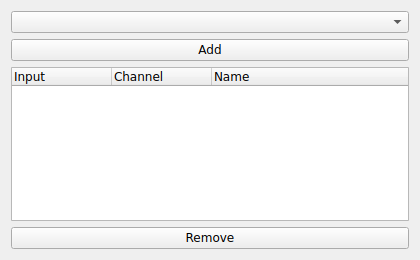

CHANNEL_PICKER
==============
|ui|

The CHANNEL_PICKER node selects channels from one or more upstream nodes and
re-publishes them as a single, reordered output stream.  It is a transformer: use
it to pick out the channels you care about, combine channels from several sources,
and assign them stable output positions.

Usage
-----

Use the dropdown to choose a source node and **Add** the channels you want.  Each
row in the table has three columns:

* **Input**: The source channel being mapped.
* **Channel**: The output channel index/position it is placed at.
* **Name**: The name given to the output channel.

The node prevents two selected channels from being mapped to the same output
position, automatically resolving conflicts to the next free index.

The result is a clean, consistently ordered stream that downstream nodes (such as
STORAGE2 or a data view) can subscribe to.
