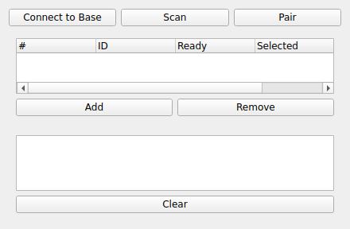

DELSYS
======
|ui|

The DELSYS node streams data from Delsys wireless sensors (e.g. Trigno EMG and IMU
sensors).  It is a generator: each enabled sensor component is republished as one
or more analog channels.

Usage
-----

Use **Connect to Base** to connect to the Delsys base station, then **Scan** for and
**Pair** sensors.  Discovered sensors are listed as **Components**, where each row
exposes:

* **ID**: The sensor/component identifier.
* **Ready**: Whether the sensor is paired and ready.
* **Selected**: Whether the component is acquired.
* **Sample Mode**: The sensor's sampling mode (scan a component to populate the
  available modes; different modes trade off channel count and sample rate).

Select the components and sample modes you want and start the node to begin
streaming.
