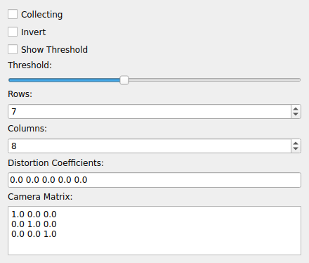

DISTORTION
==========
|ui|

The DISTORTION node corrects camera lens distortion in an image stream.  It is a
transformer: it consumes images from a camera node and republishes an undistorted
image stream, which improves the accuracy of downstream pose estimation
(:doc:`aruco`, :doc:`chessboard`).

Calibration is performed by showing a chessboard to the camera and collecting
detections; from these the node estimates the camera matrix and distortion
coefficients used to rectify subsequent frames.

Properties
----------

* **Rows** / **Columns**: The dimensions of the calibration chessboard.
* **Threshold**: Detection threshold used when finding the chessboard.
* **Show Threshold**: Display the thresholded image to aid setup.
* **Invert**: Invert the image before detection (for dark-on-light vs light-on-dark
  boards).
* **Collecting**: When enabled, accumulate chessboard detections for calibration.
* **Camera Matrix**: The 3×3 intrinsic camera matrix (estimated during calibration,
  and reused once solved).
* **Distortion Coefficients**: The lens distortion coefficients applied to rectify
  the image.
