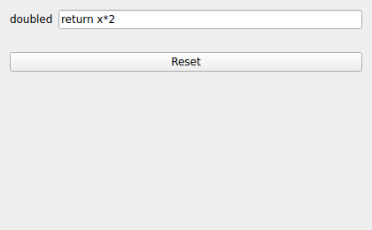

LUA
===
|ui|

The LUA node is a scriptable transformer.  It evaluates Lua expressions on incoming
data and emits the results as new channels.  Unlike the ALGEBRA node, Lua scripts
can keep state between samples, enabling filters, counters, and other stateful
processing.

Usage
-----

The node widget holds a list of **Equations**.  Use the add/remove controls to
manage them.  Each equation has:

* **Name**: The name of the output channel produced by the equation.
* **Equation**: The Lua expression to evaluate.  If it fails to parse or run, an
  error is shown next to the equation so you can correct it.

Each named equation becomes a channel in the node's output stream.
