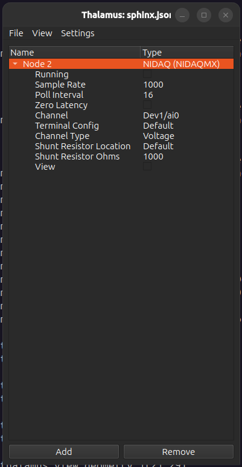

NIDAQ
=====
|ui|

The NIDAQ node is an interface for reading signals from a National Instruments DAQ.

Properties
----------

* Running: Read data from DAQ.  When true this node will generate one signal for each DAQ channel in ``Channel``.
* Sample Rate: Sample rate to for reading from DAQ.
* Poll Interval: How often to generate data in ms (Sample Rate = 1000 and Poll Interval = 16 generates 16 samples of
  data every 16 seconds)
* Zero Latency: Ignore ``Poll Interval`` and generate data immediately for each sample.  Will typically cause buffer
  overflows for high Sample Rates.
* Channel: A list of comma separated DAQ channels and channel ranges to read from.
* Terminal Config: The DAQ terminal config to use.
* Channel Type: Read voltage or current.
* Shunt Resistor Location: Location of shunt resistor to use while recording current.
* Shunt Resistor Ohms: Resistence of shunt resistor to use while recording current.
* View: Visualize signals in a new window.

