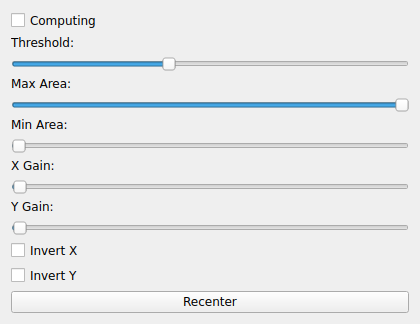

OCULOMATIC
==========
|ui|

The OCULOMATIC node is an eye-tracking transformer.  It consumes an image stream
(typically an eye camera) and produces an analog stream containing the detected
gaze position.  The detection is a thresholded blob/pupil detector, and the
output coordinates are scaled so they can be written directly to an analog output
(e.g. a NIDAQ_OUT node feeding downstream hardware).

Usage
-----

Select OCULOMATIC as the node type and choose the video node to analyze as the
node's source.  The node widget shows the live image with the detected pupil
annotated and exposes the following controls.

Properties
----------

* **Computing**: Enable/disable pupil detection.  When off, the node passes the
  image through without producing gaze coordinates.
* **Threshold**: Brightness threshold (0–255) used to segment the pupil from the
  background.
* **Min Area**: Smallest blob area accepted as a pupil.  Rejects small specular
  reflections and noise.
* **Max Area**: Largest blob area accepted as a pupil.
* **X Gain** / **Y Gain**: Scale factors applied to the detected pupil position to
  convert pixel coordinates into the output (analog) coordinate space.
* **Invert X** / **Invert Y**: Flip the sign of the X or Y output, used to match the
  camera orientation to the expected coordinate convention.
* **View**: Opens a native preview window showing the annotated image (the same
  window used by the PUPIL node).  Rendering is done in C++, so it stays live even
  while the node's Python-side widget is closed.  The preview supports both
  grayscale and RGB source images.

The annotated image is also republished, so a downstream STORAGE2 node can save
the original eye image, the annotated image, or just the gaze time series as
needed (see the STORAGE2 per-modality toggles).

Recentering
-----------

The node accepts a **recenter** request (sent from the eye-calibration UI or any
keydown forwarded to the node) that re-zeroes the gaze output around the current
pupil position.  Each recenter is written to the pipeline log as an
``Oculomatic Recenter`` event, so recordings capture exactly when the operator
recentered during a session -- important when interpreting absolute gaze
coordinates offline.
