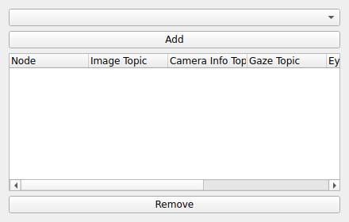

ROS2
====
|ui|

The ROS2 node bridges Thalamus to a ROS 2 system.  It is a transformer that
republishes data from Thalamus nodes onto ROS 2 topics (and TF2 frames), so that
robots and other ROS 2 components can consume Thalamus data in real time.

Usage
-----

Add the Thalamus nodes you want to bridge under the node's **Sources**.  For each
source you configure the ROS 2 topics it should be published to:

* **Image Topic**: Topic to publish the source's image stream on.
* **Camera Info Topic**: Topic to publish the associated camera calibration info on.
* **Gaze Topic**: Topic to publish gaze / coordinate data on.

Leave a topic blank to skip publishing that stream for a given source.
