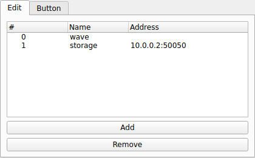

RUNNER2
=======
|ui|

The RUNNER2 node is a controller that lets you start and stop many nodes with a
single action.  Whenever its **Running** state changes it propagates that state to
every node in its target list.  Unlike the simpler RUNNER node, RUNNER2 can target
nodes on remote Thalamus instances by specifying an address for each target.

Usage
-----

Use the **Add** / **Remove** buttons in the node widget to manage the target list.
Each target row has two fields:

* **Name**: The name of the node to control.  Double-clicking this cell shows the
  available node names.
* **Address**: The address of the Thalamus instance that hosts the target node.
  Leave blank to target a node in the local pipeline.

Properties
----------

* **Running**: When toggled, every node in the target list is started or stopped to
  match.  The widget's button is colored green (START) or red (STOP) to reflect the
  current state.
* **Targets**: The list of ``Name`` / ``Address`` pairs described above.

This makes RUNNER2 the standard way to begin and end a recording across all of the
acquisition nodes in an experiment at once.
