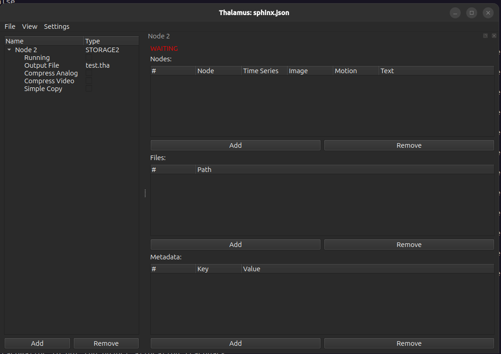

STORAGE2
=========
|ui|

The STORAGE2 node is the primary node for saving all experimental data to a file

Properties
----------

* Running: Save data.  If upstream nodes are generating data but this node is not currently running no data will be
  saved.
* Output File: The basename of the output file.  The actual name of the file will be ``<output file>.YYYYMMDD.R``
  where YYYY is the year, MM the month, DD the day, and R the recording number.  The recording number is determined by
  starting at 1 and incrementing until a full output file name that doesn't already exist is reached.  In addition,
  a ``<output file>.YYYYMMDD.R.json`` file will be creating containing a snapshot of the config when the experiment
  started.
* Compress Analog: Compress time series signals using zlib compression.
* Compress Video: Compress image data using H264 compression.
* Simple Copy: Don't record data, just copy the files in the Files list.

Usage
-----

The node widget has 3 sections.

Nodes
^^^^^

Use the add button to add a row and remove to remove rows.  Once a row is added double clicking on the Node column
will show a list of the nodes that you can select from.  By default all data from a node will be captured but the
"Time Series," "Image," "Motion," and "Text," fields can be toggled to ignore a type of data.  For example, the
OCULOMATIC node publishes time series data and republishes the eye image with annotations.  If you're already saving
the original eye image you may not be interested in using hard drive space to save this extra eye image.

Files
^^^^^

Use the add button to add a row and remove to remove rows.  Double clicking each row will allow you to type the name
of a file to copy or you can click the "..." button to open a file dialog.

At the start of every recording each of the files listed here will be copied and given the same ``.YYYYMMDD.R`` suffix
as the Output File.

Metadata
^^^^^^^^

Use the add button to add a row and remove to remove rows.  Double click the cells to edit the key/value pairs.
When a recording starts a metadata record will be generated containing the contents of this table. Additionally, at
the start of every recording a ``Rec`` key with the current recording number will be generated.

