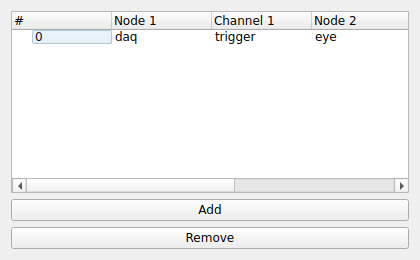

SYNC
====
|ui|

The SYNC node measures the timing alignment between pairs of channels coming from
different nodes.  It is useful for quantifying latency and verifying that two data
streams are synchronized (for example, a hardware trigger captured on two
different acquisition devices).

Usage
-----

The node widget holds a list of **Pairs**.  Use the add/remove controls to manage
them.  Each pair compares one channel against another and has the following
columns:

* **Node 1** / **Channel 1**: The first node and channel.
* **Node 2** / **Channel 2**: The second node and channel.
* **Window (s)**: The time window over which the comparison is performed.
* **Threshold**: The detection threshold used to identify the events that are aligned
  across the two channels.

For each pair the node emits the measured timing relationship as output data, which
can be visualized or recorded like any other channel.
