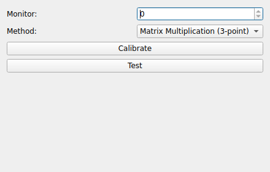

TOUCH_SCREEN
============
|ui|

The TOUCH_SCREEN node maps raw touch coordinates produced by a touch device into
calibrated screen coordinates.  It consumes a stream of raw ``(X, Y)`` points and
produces a transformed ``(X, Y)`` stream.

Properties
----------

* **Method**: The calibration model used to map raw points to screen points.

  * ``Matrix Multiplication (3-point)``: Solves a 3-point affine transform.
  * ``Linear Regression (4-point)``: Fits a least-squares mapping from 4 points.
* **Monitor**: Index of the monitor the touch surface corresponds to.
* **Transform**: The current transform (3×3 matrix) applied to incoming points.  It
  is populated automatically by the calibration routine but can also be inspected
  directly.

Calibration
-----------

The node widget provides **Calibrate** and **Test** buttons.

* **Calibrate**: Walks you through touching a sequence of on-screen targets
  (3 or 4 depending on the selected Method).  After each target, press any key to
  advance.  When all targets have been collected the ``Transform`` is computed and
  stored in the node's configuration.
* **Test**: Lets you verify the resulting calibration by touching the screen and
  observing where the mapped point lands.
