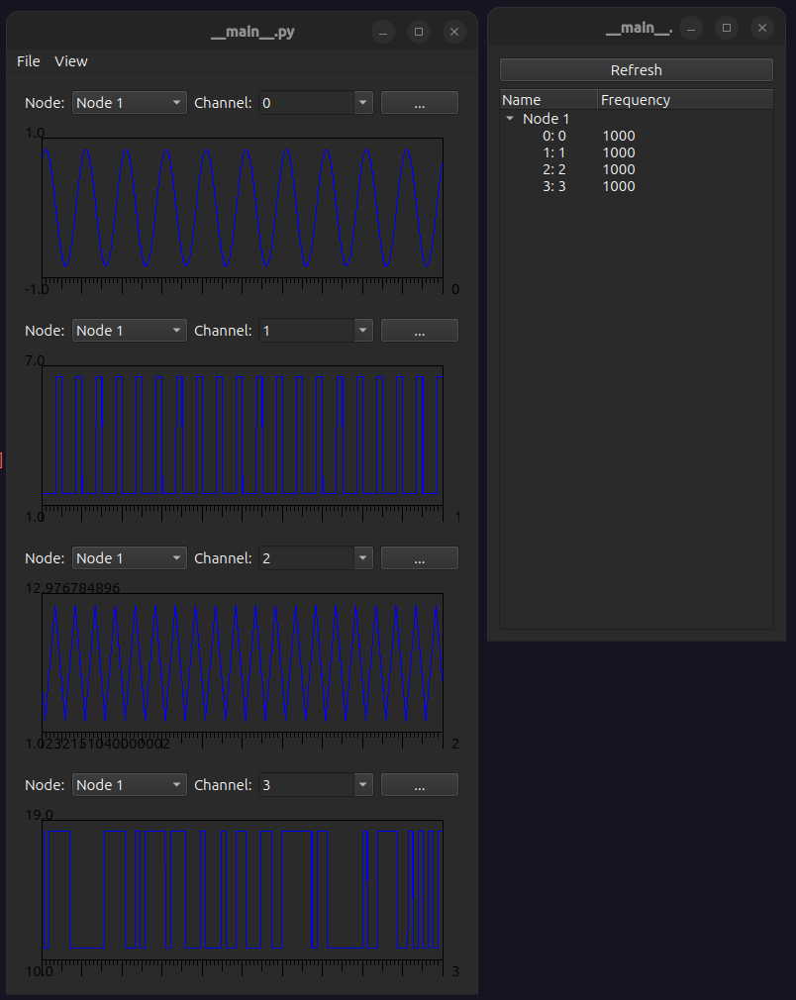

WAVE
====
|ui|

The WAVE node is a software signal generator capable of generating several wave forms.

Properties
----------

* Running: Generate data.
* Sample Rate: Sample rate of the signals.
* Poll Interval: How often to generate data in ms (Sample Rate = 1000 and Poll Interval = 16 generates 16 samples of
  data every 16 seconds)
* View: Open window to visualize signals.

Usage
-----

In the node widget you can add a signal with the add button and remove selected signals with the remove button and
each signal has the following properties

* #: Incrementing number, also the name of the signal channel
* Frequency: Frequency of the signal
* Amplitude: Amplitude of the signal
* Shape

  * Sine: Sine wave
  * Square: Square wave
  * Triangle Wave: Triangle wave
  * Random: At a rate equal to the signal frequency this signal randomly switches to either :math:`amplitude + offset` or :math:`offset`
* Offset: Signal DC offset
* Duty Cycle: What portion of the signal period is it high.  Only applies to square waves.
* Phase: Phase shift to apply to signal

|signals|

