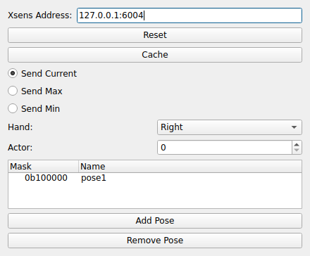

XSENS
=====
|ui|

The XSENS node streams motion-capture pose data and republishes it as a motion
(MOCAP) stream of body segments, each with a position and a quaternion rotation.
It can connect to an Xsens motion-capture source.

Properties
----------

* **Xsens Address**: Address of the motion-capture data source (default
  ``127.0.0.1:6004``).
* **Hand**: Which hand the pose corresponds to (``Left`` or ``Right``).
* **Send Type**: How the pose value is reduced before sending -- ``Send Current``,
  ``Send Max``, or ``Send Min``.
* **Actor**: The actor index to stream when multiple actors are present.
* **Poses**: A list of poses to publish.  Each pose pairs a segment **Mask** with a
  **Name**; use **Add Pose** / **Remove Pose** to manage the list.

The **Reset** and **Cache** buttons clear and persist the node's tracked calibration.
The published segments can be recorded by a STORAGE2 node (via its **Motion**
modality) and consumed by downstream nodes such as HEXASCOPE.
