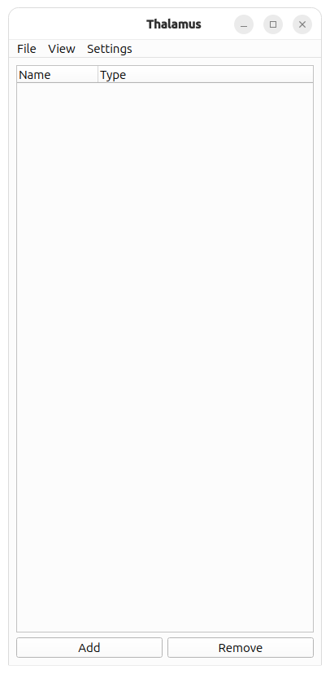

Quick Start
===========

Prerequisites
-------------

Thalamus requires Python and supports Windows, Mac, and Linux.  Drivers and runtimes for integration with third party
devices such as GenTL cameras and National Instruments DAQs will need to be installed separately.

Installation
------------

First, create a python virtual environment and activate it.  This is commonly needed to make sure the version of grpc that pip installs is compatible with Thalamus.  https://docs.python.org/3/library/venv.html

.. code-block::
   
   python -m venv venv-thalamus
   #Mac and Linux
   source venv-thalamus/bin/activate
   #Windows
   call venv-thalamus/scripts/activate

From the releases page download the whl file for your platform and install it.  https://github.com/cajigaslab/Thalamus/releases

.. code-block::

   python -m pip install thalamus-0.3.37-py3-none-manylinux_2_27_x86_64.whl 

You should now be able to run the pipeline program and see a window appear with an empty node list.

.. code-block::

   python -m thalamus.pipeline

|empty|

 
Adding a Node
-------------

.. video:: demo_WAVE.mp4
   :width: 640
   :autoplay:
   :nocontrols:
   :loop:

Creating Nodes
--------------

Click the Add button to add a node with the default type, NONE.  A NONE node is the simplest type of node and does nothing.  When you click on the node type a dropdown list of other node types appear that you can select from, each implementing a different functionality.  In this demo we'll select the WAVE node which is used to generate periodic signals.

Node Properties
---------------

Once the WAVE type is selected the node becomes expandable because it now has a series of properties you can set.

* Running: Whether or not the node is currently generating data
* Sample Rate: The frequency of the data.
* Poll Interval: How often to generate data.  With a sample rate of 1000 Hz and poll interval of 16 ms the node generates 16 samples every 16 ms.
* View: Whether or not the legacy data viewer is visible.

Node Widgets
------------

Most nodes will have some configuration options in this list and some may even have all of their configuration options here.  However, many nodes require a more complicated UI and will often times have a Node Widget that will appear to the right when they are selected.  This is a custom UI specific to each type of node.  In the case of the WAVE node the Node Widget allows you to add and remove channels and adjust the parameters of each channel including shape, frequency, amplitude, etc.

Data View
---------

You can use View > Add Data View to add a data view.  In this view you can select a node and any channel on that node.  The channels on a node are only known while it's generating data so you first need to start the WAVE node to see a list of channels.  You can also add rows and columns to view multiple channels of data.

Once running is clicked data will appear in the data view and the data stream will pause and restart as Running is toggled.

Recording
---------

Adding nodes is how the functionality of Thalamus is extended and data is recorded by adding a STORAGE2 node.

.. admonition:: Note

  Sometimes expanding a node's functionality requires backwards incompatible changes to it's config fields.  When this happens a new node is created with a number so that we don't disrupt users of the previous version, for example, STORAGE, STORAGE2, STORAGE3, etc.

Nodes can be divided into 4 categories:

* Generators: These generate data for other nodes to consume:

  * WAVE: Generate periodic signals
  * NIDAQ: Record from a National Instruments DAQ and provide that data to Thalamus.

* Consumers: These consume data:

  * STORAGE2: Saves data to disk
  * NIDAQ_OUT: Takes data from Thalamus and outputs it on a National Instruments DAQ.

* Transformers: These consume and generate data:

  * OCULOMATIC: Takes in image data and generates eye coordinates.
  * TOUCH_SCREEN: Takes in a stream of data points generated by a touch screen and generates pixel coordinates

* Controllers:

  * RUNNER2: When it's running status changes it propogates this to other nodes.  This allows you to start and stop multiple nodes with a single click.
  * TASK_CONTROLLER: Sends a message to start and stop a task controller if it's running.

To demonstrate saving data we are going to have a STORAGE2 node consume data from our WAVE node.

.. video:: demo_STORAGE2.mp4
   :width: 640
   :autoplay:
   :nocontrols:
   :loop:

In the video above we do the following

* In addition to changing node types we can change node names by clicking on the name.  We demonstrate this by changing the names to something more informative: wave and storage.
* We set the new node's type to STORAGE2 and use the Node Widget to have it subscribe to wave's data.
* Once storage starts running it will save any data that wave generates.
* Storage also generates a series of diagnostic signals such as how many bytes per second it's writing to disk.
* The data is stored in the file test.tha.YYYYMMDD.N, where YYYY is the year, MM the month, DD the day of the month, and N is a number that increments with each recording.

File Format
-----------

The Thalamus file format is a series of records.  Every time a node that STORAGE2 is subscribed to generates data a record is appended to the file containing that data.  The simplest way to view the data is with the thalamus.record_reader2 module.

.. code-block::

  (venv) jarl@jarl:~/Thalamus$ python -m thalamus.record_reader2 test.tha.20260218.2
  filename test.tha.20260218.2
  time: 680587776636175
  node: "storage"
  metadata {
    keyvalues {
      key: "Rec"
      integral: 2
    }
  }
  
  
  analog {
    data: 0.989576118602651
    data: 0.98865174473791417
    data: 0.98768834059513766
    data: 0.98668594420786837
    data: 0.98564459514899816
    data: 0.98456433452920522
    data: 0.98344520499533
    data: 0.98228725072868861
    data: 0.98109051744333409
    data: 0.979855052384247
    data: 0.97858090432547229
    data: 0.97726812356819337
    data: 0.97591676193874743
    data: 0.97452687278657724
    data: 0.9730985109821263
    data: 0.9716317329146742
    data: -1
    data: -1
    data: -1
    data: -1
    data: -1
    data: -1
    data: -1
    data: -1
    data: -1
    data: -1
    data: -1
    data: -1
    data: -1
    data: -1
    data: -1
    data: -1
    spans {
      end: 16
      name: "0"
    }
    spans {
      begin: 16
      end: 32
      name: "1"
    }
    sample_intervals: 1000000
    sample_intervals: 1000000
    time: 680587780991040
  }
  time: 680587780991040
  node: "wave"
  
  
  analog {
    data: 0.9701265964901058
    data: 0.96858316112863163
    data: 0.96700148776243522
    data: 0.96538163883327366
    data: 0.96372367829001
    data: 0.96202767158608593
    data: 0.96029368567694318
    data: 0.95852178901737606
    data: 0.95671205155883088
    data: 0.95486454474664284
    data: 0.95297934151721886
    data: 0.95105651629515375
    data: 0.94909614499029438
    data: 0.94709830499474468
    data: 0.94506307517980481
    data: 0.94299053589286519
    data: 0.94088076895422568
    data: -1
    data: -1
    data: -1
    data: -1
    data: -1
    data: -1
    data: -1
    data: -1
    data: -1
    data: -1
    data: -1
    data: -1
    data: -1
    data: -1
    data: -1
    data: -1
    data: -1
    spans {
      end: 17
      name: "0"
    }
    spans {
      begin: 17
      end: 34
      name: "1"
    }
    sample_intervals: 1000000
    sample_intervals: 1000000
    time: 680587797299457
  }
  time: 680587797299457
  node: "wave"

Each record contains a time in nanoseconds, the name of the node that generated the data and a "body" which depends on the data type generated.  The time is not a Unix Epoch, it is a steady clock relative to an arbitrary point in time.

The first record in the thalamus file contains a metadata body that contains a single keyvalue indicating the recording number (the .N suffix on the thalamus file), and the following messages contain analog bodies generated by the wave node.

Hydration
---------

To generate a file amenable to analysis the thalamus.hydrate module can be used to generate an HDF5 file.

.. code-block::

  (venv)  130 jarl@jarl:~/Thalamus$ python -m thalamus.hydrate test.tha.20260218.2
  Measuring Capture File
  analog/wave/0/data 292715
  analog/wave/1/data 292715
  Writing H5 file: test.tha.20260218.2.h5
  Duration: 867 ms

The generated .h5 file will contain 2 datasets for each channel:

* analog/<node>/<channel>/data: The data samples
* analog/<node>/<channel>/received: The timing data.  Each row corresponds to a record in the file and contains:

  * The record's timestamp
  * The number of samples read so far.
  * The remote time (in this example it's just 0)

  This dataset can be used to reconstruct the exact time that each data point was generated.

Data Frame
----------

You can also extract data from Thalamus files using the thalamus.dataframe module.  At minimum this module accepts a node name and input file and will output that node's data as a .parquet file.  It also accepts further parameters to select a subset of channels, different types of data, output file name, and formats.

.. code-block::

   (venv) jarl@jarl:~/Thalamus$ python -m thalamus.dataframe --help
  usage: DataFrame generator [-h] -n NODE [-c CHANNELS] [-t {text,analog}] -i INPUT [-o OUTPUT]
                             [-f {csv,excel,feather,html,json,latex,orc,parquet,pickle,sql,stata,xml}]
  
  options:
    -h, --help            show this help message and exit
    -n NODE, --node NODE
    -c CHANNELS, --channels CHANNELS
    -t {text,analog}, --type {text,analog}
    -i INPUT, --input INPUT
    -o OUTPUT, --output OUTPUT
    -f {csv,excel,feather,html,json,latex,orc,parquet,pickle,sql,stata,xml}, --format {csv,excel,feather,html,json,latex,  orc,parquet,pickle,sql,stata,xml}

.. video:: demo_dataframe.mp4
   :width: 640
   :autoplay:
   :nocontrols:
   :loop:

Starting and Stopping Multiple Nodes
------------------------------------

For any non trivial experiment you will likely want to start and stop multiple nodes at the same time which can be done using the RUNNER2 node.  Simply configure it with a list of nodes to control and whenever the RUNNER2 node's Running state changes it will update all nodes on the list.

.. video:: demo_RUNNER2.mp4
   :width: 640
   :autoplay:
   :nocontrols:
   :loop:

Saving Experiments
------------------

Node configurations and window layout's can be saved and reloaded

.. video:: demo_persistence.mp4
   :width: 640
   :autoplay:
   :nocontrols:
   :loop:

