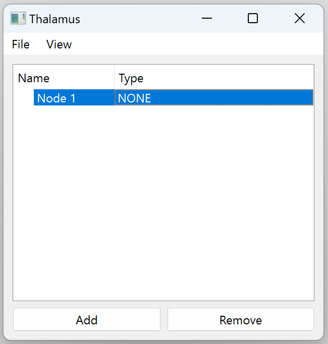
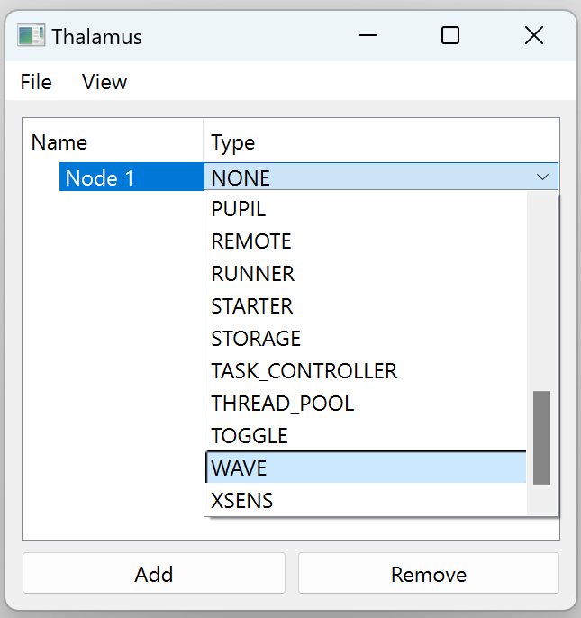
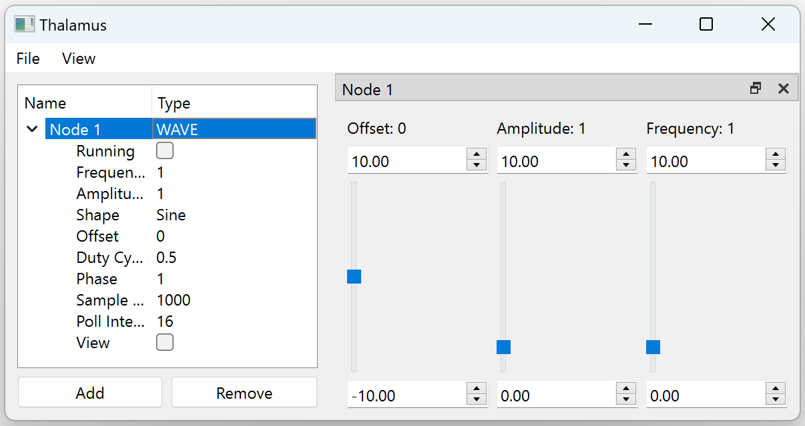
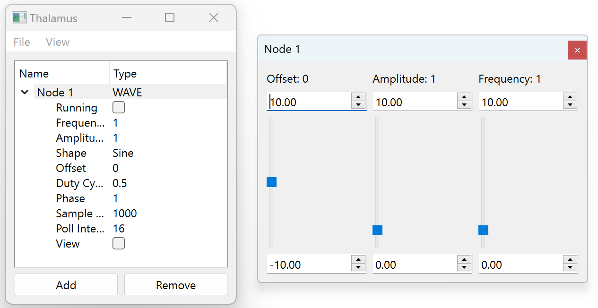

Usage
=====

Prerequisites
-------------

Thalamus requires Python and supports Windows and Linux

Installation
------------

Download a .whl file for your OS and install it using pip

.. code-block::
   :caption: Windows

   python -m pip install thalamus-0.3.0-py3-none-win_amd64.whl

.. code-block::
   :caption: Linux

   python -m pip install thalamus-0.3.0-py3-none-manylunux_2_27.whl

You should now be able to run any of the Thalamus tools.

.. code-block::

   python -m thalamus.pipeline # Data pipeline, no task controller
   python -m thalamus.task_controller # Data pipeline and task controller
   python -m thalamus.hydrate # Convert capture files to sharable formats
 
Example: Adding a WAVE Node
---------------------------

Startup a pipeline by executing the thalamus.pipeline module.  After a moment a window with an empty list should
appear.

.. code-block::
   
   python -m thalamus.pipeline

Creating Nodes
^^^^^^^^^^^^^^

In the window that pops up click the Add button to create a node.  Nodes are the building blocks of a pipeline which
will define how data is collected, processed, and saved or exported.  The node we've just added is the default type,
NONE, which does nothing.  When you double click on the node type a Combo Box will appear that allows you to change
its type.  Do this and select WAVE which is a type of node that generates a continuous timeseries signal.  Also, you 
can rename the node by clicking on the node's name.

|none| |wave|

Configuring and Controlling Nodes
^^^^^^^^^^^^^^^^^^^^^^^^^^^^^^^^^

Once you change the node type to WAVE the row will become expandable and expanding it will show settings that allow
you to configure the node's behavior.  The properties Frequency, Amplitude, Shape, among other will change the signal
that this node will generate.  Running will start/stop signal generation and View will show a basic widget to view
the signal.

In addition, a node widget will appear to the right which contains a UI specific to each type of node.  As you select
different nodes the node widget will change to controls for the selected node.  If you need to control multiple nodes
you can undock the node widget and place it anywhere on your desktop that is most convenient for you.  Also, this will
cause the undocked widget to persist as you selected different nodes in the main window.

|docked| |undocked|

Generating and Viewing Data
^^^^^^^^^^^^^^^^^^^^^^^^^^^

Check the "Running," checkbox and the pipeline will start generating data though nothing will happen to indicate that.
To view the data select "View" -> "Add Data View" and a data view window will appear.  In the Node combo box select
The name of the WAVE node and in the Channel combo box select "0" and the wave will appear in the data view.  The UI 
will only detect the channels on the node while it's running so if there are no options in the channel combo box start
the WAVE node or just type the channel name "0".  The effects of manipulating the sliders and parameters of the WAVE
node can be immediately seen in this window.

The "..." button provides additional options for the view.  You can configure the view to draw the current channel 
value as text, fix the Y axis to a static range instead of dynamically scaling, or switch to a Spectrogram view.

Chaining Nodes
^^^^^^^^^^^^^^

Add a new node and set it's type to LUA.  This creates a LUA node which can take data from an upstream node, apply Lua
expressions to it, and output the results.

The only field on the LUA node is "Source" which you can fill with the name of a node to receive data from.  Once you
set this field to the name of the WAVE node it will instantly start generating data which you can view in the data
view by clicking "View" -> "Add Row", "View" -> "Add Column", or from the main window "View" -> "Add Data View" and
setting the node in the new view to the LUA and and the channel to "0". By default the LUA node is simply republishing
the WAVE node's data which isn't very interesting.  To change this bring up a node widget for the LUA node which
should contain a text field for each channel in the upstream node, in this case just the channel "0", and type in 
"math.abs(x)".  The data view should now show that the Lua node is outputting the absolute value of the WAVE node.  In
addition to the transformed upstream data the LUA node also publishes a timeseries containing the amount of time it
takes to transform the upstream data.

Saving Data
^^^^^^^^^^^

